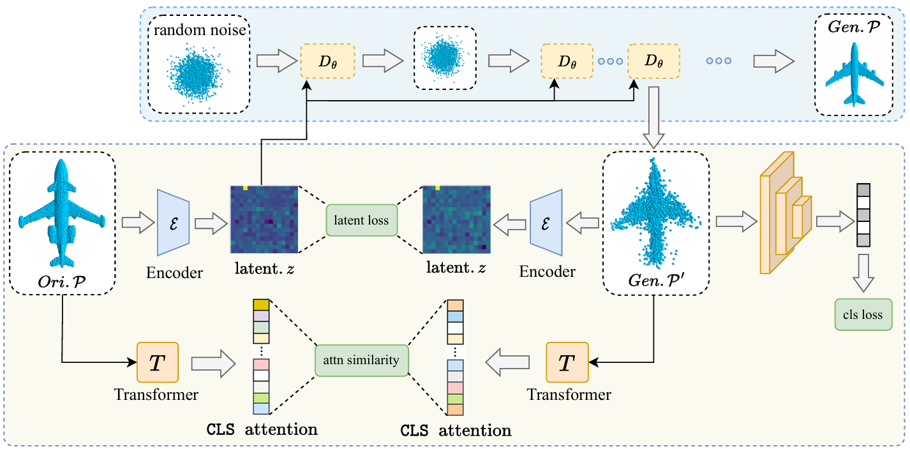

# Shape-Consistent Attack

<p align="center"></p>

## Installation

### 1. Clone (or download) the code
```
git clone https://github.com/xgQiu3/sc-attack.git
```
### 2. Environment and dependencies
The code is tested with Python3.7, Pytorch == 1.8.0 and CUDA == 11.1
```
conda create --name sc python=3.7
conda activate sc
pip install torch==1.8.0+cu111 torchvision==0.9.0+cu111 torchaudio==0.8.0 -f https://download.pytorch.org/whl/torch_stable.html
pip install spconv-cu113
pip install -r requirements.txt
```

## Getting Started

### Dataset Preparation
Download the dataset [ModelNet40](https://shapenet.cs.stanford.edu/media/modelnet40_normal_resampled.zip) and [ShapeNetPart](https://shapenet.cs.stanford.edu/ericyi/shapenetcore_partanno_segmentation_benchmark_v0.zip), then place them in the **data** folder or unzip them into your own dataset path (remember to update DATA-PATH when running).
After the preparation, the format of how the dataset is provided:

```
data (root)
    ├── modelnet40_normal_resampled (containing 12,311 watertight CAD models from 40 categories)
      ├──airplane
        ├──airplane_0001.txt
            ...
        ...
      ├──modelnet40_shape_names.txt
      ├──modelnet40_train.txt
      ├──modelnet40_test.txt
    ├── shapenetcore_partanno_segmentation_benchmark_v0_normal (for 3D object recognition and segmentation)
```

The dataset - related files are located within [data_utils](https://github.com/xgQiu3/sc-attack/blob/main/data_utils) and you can select specific classes as needed. As for ModelNet40, you can set category='x'. For ShapeNetPart, set class_choice=['x']


### Pretrained Models
You can download the following [victim models](https://drive.google.com/file/d/1L25i0l6L_b1Vw504WQR8-Z0oh2FJA0G9/view?usp=sharing) and unzip them at ./checkpoint:
[PointNet](https://github.com/charlesq34/pointnet), 
[PointNet++](https://github.com/charlesq34/pointnet2), 
[DGCNN](https://github.com/WangYueFt/dgcnn), 
[PointCNN](https://github.com/yangyanli/PointCNN), 
[PointConv](https://github.com/DylanWusee/pointconv_pytorch), 
[RS-CNN](https://github.com/Yochengliu/Relation-Shape-CNN), 
[PCT](https://github.com/Strawberry-Eat-Mango/PCT_Pytorch), 
[PAConv](https://github.com/CVMI-Lab/PAConv), 
[SimpleView](https://github.com/princeton-vl/SimpleView)
[CurveNet](https://github.com/tiangexiang/CurveNet)
and the [Transformer](https://github.com/Julie-tang00/Point-BERT).
The model configs are located within [attention](https://github.com/xgQiu3/sc-attack/tree/main/attention) and the recognition model utils are located within [model/classifier](https://github.com/xgQiu3/sc-attack/tree/main/model/classifier).


### Attacking and testing
To launch the white-box attack, simply run:
```
CUDA_VISIBLE_DEVICES='x' python main.py
```

As for the black-box attack, run:
```
CUDA_VISIBLE_DEVICES='x' python main.py --surrogate_model_1 your/white_box/model --target_model your/black_box/model
```
